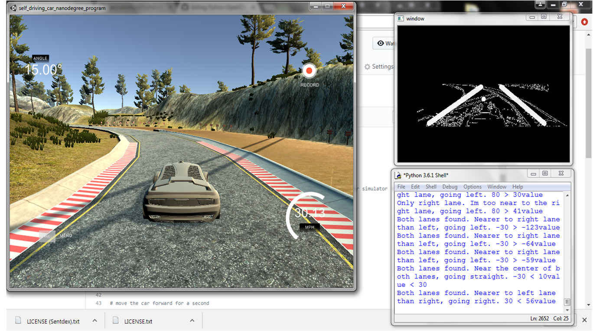
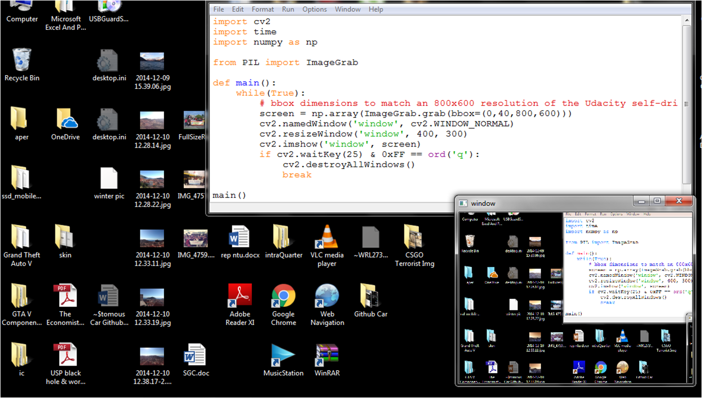
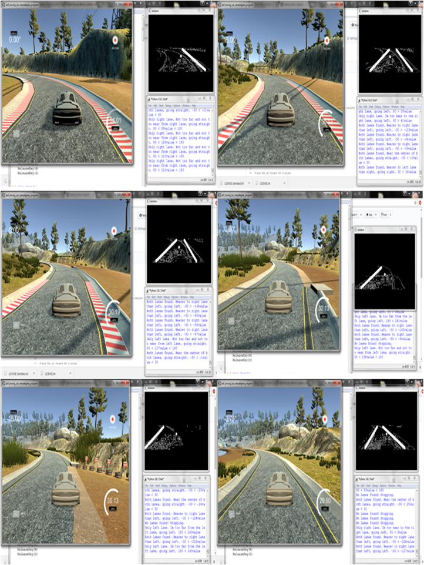
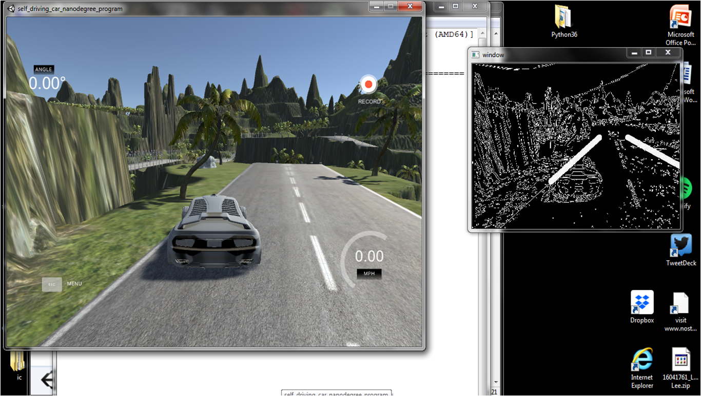

# Python-OpenCV-Automated-Car



## A small learning project to get comfortable with using Python and OpenCV
In this project, I touched on using certain 
OpenCV tools in an attempt to identify the lanes on the road of a Udacity self-driving car simulator. After which, rules were hardcoded to allow the car to drive itself based on the detected lane markings.
  
Spoilers: The car drives fine on a straight road. The chances of the car going off-road is proportional to how bent the road is.

## Getting Started
The initial goals are:
1) Access the game screen
2) Send keyboard input to game screen
3) Use OpenCV on the game screen

Before that, we need to import cv2, time and numpy.

To achieve step 1, we will need to install the Python Imaging Library(PIL) and import ImageGrab.
```python
import cv2
import time
import numpy as np

from PIL import ImageGrab

def main():
    while(True):
        # bbox dimensions to match an 800x600 resolution of the Udacity self-driving car simulator in windowed mode   
        screen = np.array(ImageGrab.grab(bbox=(0,40,800,600)))
        cv2.namedWindow('window', cv2.WINDOW_NORMAL)
        cv2.resizeWindow('window', 400, 300)
        cv2.imshow('window', screen)
        if cv2.waitKey(25) & 0xFF == ord('q'):
            cv2.destroyAllWindows()
            break

main()
```
(put image of imagegrab running)


To achieve step 2, we will need to [download](directkeys.py) and import directkeys.py.
```python
from directkeys import PressKey, ReleaseKey, W, A, S, D

# move the car forward for a second
def main():
    while(True):
        PressKey(W)
        time.sleep(1)
```
Disclaimer: directkeys.py came from [Sentdex](https://pythonprogramming.net/direct-input-game-python-plays-gta-v/) who took it from an answer in [stackoverflow](https://stackoverflow.com/questions/14489013/simulate-python-keypresses-for-controlling-a-game).

## Step 3 - Using OpenCV on the game screen
The following techniques were used:

- Color Selection
- Canny Edge Detection
- Region of Interest Selection
- Hough Transform Line Detection
- Averaging and Extrapolating Lines

To complete these 5 steps, you can refer to an excellent step-by-step guide by Mr Naoki Shibuya [here](https://github.com/naokishibuya/car-finding-lane-lines)! Else, you can click [here](Codes/fill in with file name) to browse the codes for these 5 steps. 

### Step 3 - Notes
It was decided that HSL

## Finding car lanes? Checked.


## Self-driving
The idea I decided to go with is a simple one. 
1) Attain the Y- and X-coordinates that is at the centre of the identified lane line/lines.
```python

```
2) If two lane lines have been identified, the centre of the car is to stay between the two calculated X-coordinates.

```python
def main():
    while(True):
        lower_limit = -65
        upper_limit = 65

        if lower_limit < abs(right_midx - 400) - abs(left_midx - 400) < upper_limit:
            straight()
            print('Both lanes found. I am near the centre of both lanes, going straight. {} < {}value < {}'
                  .format(two_lower_limit, abs(right_midx - 400) - abs(left_midx - 400), two_upper_limit))
```

3) If only one of the lane line has been indentified, the centre of the car is to stay a safe distance from the calculated X-coordinate.

```python
def main():
    while(True):
        left_lower_limit = 70
        left_upper_limit = 120

        if left_lower_limit < abs(left_midx - 400) < left_upper_limit:
            straight()
            print('Only left lane. Not too far and not too near from left lane, going straight. {} < {}value < {}'
                  .format(left_lower_limit, abs(left_midx - 400), left_upper_limit))
```
The values of the lower and upper limit was decided by trial and error. In order to tidy up the codes and increase the efficiency of the trial and error process, [three functions](Codes/insert name here) were created.

## Off it goes


## Slight adjustments
While watching the code run, I noticed that although you could differentiate the right and left lane with their gradients, there was nothing stopping the computer from finding a 'Right Lane' on the left side of the road. 


### Initial code
```python
if slope < -0.48: 
    left_lines.append((slope, intercept))
    left_weights.append((length))
elif slope > 0.48:
    right_lines.append((slope, intercept))
    right_weights.append((length))
```

### Adjusted code
The X-Coordinates of the right and left lane are now restricted to their respective sides.
```python
if slope < -0.48 and x1 < 500 and x2 < 500: 
    left_lines.append((slope, intercept))
    left_weights.append((length))
elif slope > 0.48 and x1 > 300 and x2 > 300:
    right_lines.append((slope, intercept))
    right_weights.append((length))
```

## Full Code
For the full code, click [here](Codes/ insert code name here)

## Final thoughts


## Built With

* [Dropwizard](http://www.dropwizard.io/1.0.2/docs/) - The web framework used
* [Maven](https://maven.apache.org/) - Dependency Management
* [ROME](https://rometools.github.io/rome/) - Used to generate RSS Feeds

## Contributing

Please read [CONTRIBUTING.md](https://gist.github.com/PurpleBooth/b24679402957c63ec426) for details on our code of conduct, and the process for submitting pull requests to us.

## Versioning

We use [SemVer](http://semver.org/) for versioning. For the versions available, see the [tags on this repository](https://github.com/your/project/tags). 

## Authors

* **Billie Thompson** - *Initial work* - [PurpleBooth](https://github.com/PurpleBooth)

See also the list of [contributors](https://github.com/your/project/contributors) who participated in this project.


## Acknowledgments
This project would not have been possible without:
* **Harrison Kinsley** - [His Github link](https://github.com/Sentdex/)
* **Naoki Shibuya** - [His Github link](https://github.com/naokishibuya)

