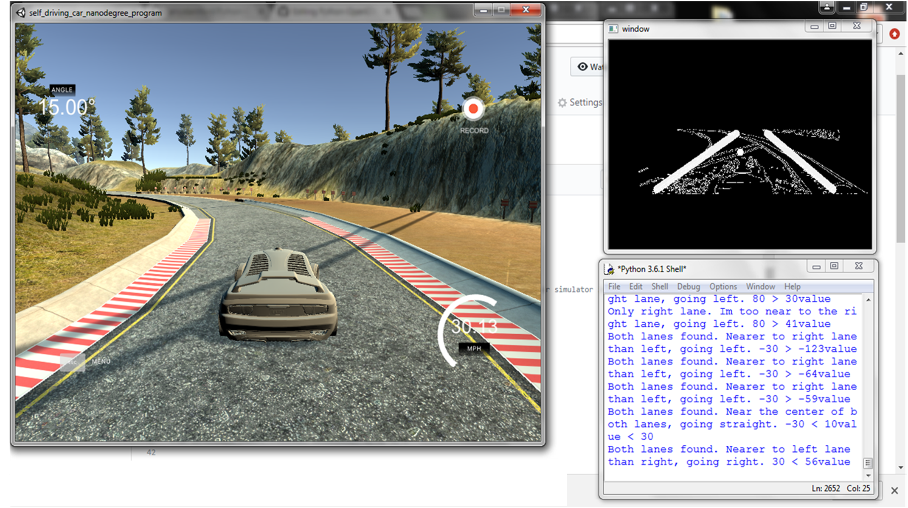
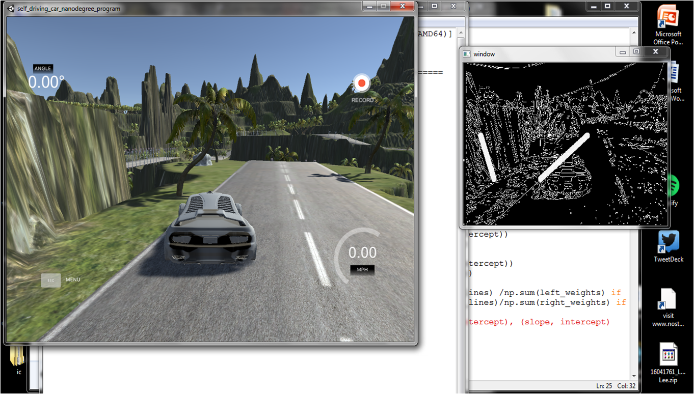

# Python-OpenCV-Automated-Car



## A small learning project with using Python and OpenCV
In this project, I touched on using certain OpenCV tools in an attempt to identify the lanes on the road of a Udacity self-driving car simulator. After which, rules were hardcoded to allow the car to drive itself based on the detected lane markings.
  

## Getting Started
The initial goals are:
1) Capture the game screen
2) Send keyboard inputs to the game
3) Use OpenCV on the game screen


## Step 1 - Capturing the game screen

To achieve step 1, we will need to install the Python Imaging Library(PIL) and import ImageGrab.
```python
import cv2
import time
import numpy as np

from PIL import ImageGrab

def main():
    while(True):
        # bbox dimensions to match an 800x600 resolution of the Udacity self-driving car simulator in windowed mode   
        screen = np.array(ImageGrab.grab(bbox=(0,40,800,600)))
        cv2.namedWindow('window', cv2.WINDOW_NORMAL)
        cv2.resizeWindow('window', 400, 300)
        cv2.imshow('window', screen)
        if cv2.waitKey(25) & 0xFF == ord('q'):
            cv2.destroyAllWindows()
            break

main()
```

## Step 2 - Sending keyboard inputs to the game
We will need to [download](directkeys.py) and import directkeys.py.
```python
from directkeys import PressKey, ReleaseKey, W, A, S, D

# move the car forward for a second
def main():
    while(True):
        PressKey(W)
        time.sleep(1)
```
Disclaimer: directkeys.py came from [Sentdex](https://pythonprogramming.net/direct-input-game-python-plays-gta-v/) who took it from an answer in [stackoverflow](https://stackoverflow.com/questions/14489013/simulate-python-keypresses-for-controlling-a-game).

## Step 3 - Using OpenCV on the game screen
The following techniques were used:

- Color Selection
- Canny Edge Detection
- Region of Interest Selection
- Hough Transform Line Detection
- Averaging and Extrapolating Lines

To complete these 5 steps, you can refer to an excellent step-by-step guide by Mr Naoki Shibuya [here](https://github.com/naokishibuya/car-finding-lane-lines)! Else, you can click [here](Codes/OpenCV%20Steps%20%2B%20Averaging%20Lines.py) to browse the codes for these 5 steps. 

## Finding car lanes? Checked.


## Self-driving - Attaining the necessary coordinates

The idea I decided to go with is a simple one. 
1) Attain the X-coordinates on the identified lane line/lines for Y = 300.
```python
def get_middle_xcoordinate(y_centre, line):
    try:
        if line is None:
            return None
        slope, intercept = line
        x_centre = int((y_centre - intercept)/slope)
        return x_centre
    except Exception as e:
    #print(str(e))
        pass

def middle_xcoordinate(lines):
    try:
        left_lane, right_lane = average_slope_intercept(lines)
        y_centre = 300
        left_x = get_middle_xcoordinate(y_centre, left_lane)
        right_x = get_middle_xcoordinate(y_centre, right_lane)
        return left_x, right_x
    except Exception as e:
    #print(str(e))
        pass
```
2) If two lane lines have been identified, the centre of the car is to stay between the two calculated X-coordinates.
```python
def main():
    while(True):
        lower_limit = -65
        upper_limit = 65

        if lower_limit < abs(right_x - 400) - abs(left_x - 400) < upper_limit:
            straight()
            print('Both lanes found. I am near the centre of both lanes, going straight. {} < {}value < {}'
                  .format(two_lower_limit, abs(right_x - 400) - abs(left_x - 400), two_upper_limit))
```

3) If only one of the lane line has been indentified, the centre of the car is to stay a safe distance from the calculated X-coordinate.
```python
def main():
    while(True):
        left_lower_limit = 70
        left_upper_limit = 120

        if left_lower_limit < abs(left_x - 400) < left_upper_limit:
            straight()
            print('Only left lane. Not too far and not too near from left lane, going straight. {} < {}value < {}'
                  .format(left_lower_limit, abs(left_x - 400), left_upper_limit))
```
The values of the lower and upper limit was decided by trial and error. In order to tidy up the codes and increase the efficiency of the trial and error process, [three functions](Codes/three_functions.py) were created.

## Off it goes


## Slight adjustments
While watching the code run, I noticed that although you could differentiate the right and left lane with their gradients, there was nothing stopping the computer from finding a 'Right Lane' on the left side of the road. 


### Initial code
```python
if slope < -0.48: 
    left_lines.append((slope, intercept))
    left_weights.append((length))
elif slope > 0.48:
    right_lines.append((slope, intercept))
    right_weights.append((length))
```

### Adjusted code
The X-Coordinates of the right and left lane are now restricted to their respective sides.
```python
if slope < -0.48 and x1 < 500 and x2 < 500: 
    left_lines.append((slope, intercept))
    left_weights.append((length))
elif slope > 0.48 and x1 > 300 and x2 > 300:
    right_lines.append((slope, intercept))
    right_weights.append((length))
```

## Final thoughts
This was a simple "old school" self-driving car project that can be further improved by adding object detection. For example, object detection could identify other cars on the road so as to avoid it. Self-driving technology has changed a lot since Artificial-Intelligence came into the picture. Instead of relying on simple rules or machine-learning algorithms to train cars to drive, people are taking inspiration from cognitive science to give machines a kind of common sense and the ability to quickly deal with new situations. The future of autonomous technologies is certainly one to keep an eye on.

## Full Code
To browse the full code, you can click [here](Codes/Full_Code_Python_OpenCV_Automated_Car.py).

## Acknowledgments
This project would not have been possible without:
* **Harrison Kinsley** - [His Github link](https://github.com/Sentdex/)
* **Naoki Shibuya** - [His Github link](https://github.com/naokishibuya)

